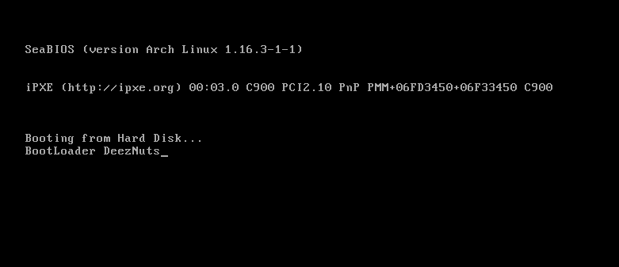

# A shitty hello world bootloader implementation

The BIOS will read for the devices on the system and read the first 512 bytes of them, and if it finds a magic number at its end(2 bytes - at 511, 512) `0x55AA`, the BIOS loads it at `0x7c00` and treats whatever was at the beginning of the 512 bytes as code, the so-called boot loader.

### Run the Code
1. Generates a 512 byte long binary
```bash
nasm -f bin ./bootloader.asm
```

2. Qemu
here we are specifying our binary as a hard disk
```bash
qemu-system-x86_64 -hda ./bootloader
```

### Example Output

